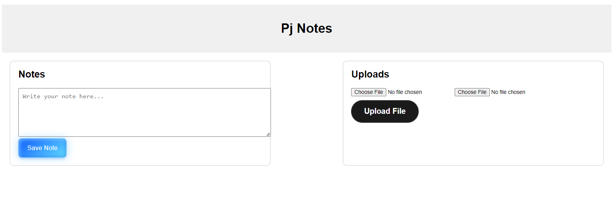

# Note Taker App

A simple note-taking app that allows users to write and save notes, upload images and documents, and edit and delete notes.

## Features
- Write and save notes
- Upload images and documents
- Edit notes
- Delete notes
- Display saved notes and uploaded files

## Getting Started
##CLICK ME##
-  https://programerpj69.github.io/Pj_Notes_web/

### Usage
- Write a note in the text area and click the **Save Note** button to save the note.
- Upload an image or document by selecting a file and clicking the **Upload File** button.
- Edit a note by clicking the **Edit** button next to the note.
- Delete a note by clicking the **Delete** button next to the note.

## Technologies Used
- HTML5
- CSS3
- JavaScript (ES6)
- FileReader API for file uploads

## License
This project is licensed under the MIT License.

## Contributing
Contributions are welcome! If you'd like to contribute to this project, please fork the repository and submit a pull request.

## Author
[Rajkaml Singh (Programerpj)]

## Acknowledgments
This project was inspired by the need for a simple note-taking app with basic features. I hope you find it useful!

##VIEW

